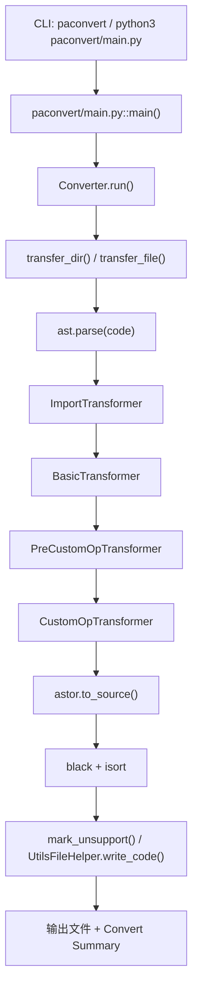

# PaConvert 是怎么运行的：源码阅读、API 转换链路与二次开发指南

这个仓库不是 PaConvert 源码，也不是官方 README 的改写版。它只做一件事：把 `paconvert/main.py -> converter -> transformer -> matcher -> 输出` 这条线拆开，给第一次接手 PaConvert 的工程师一个可落地的读码入口。  
如果你现在的目标是“先看懂它怎么跑，再改一个 API 映射”，先看 [docs/02-how-paconvert-runs.md](./docs/02-how-paconvert-runs.md) 和 [docs/04-one-api-full-trace.md](./docs/04-one-api-full-trace.md)。  
如果你更想先看实际输入输出，再回头读源码，直接从 [examples/simple_add](./examples/simple_add) 和 [examples/optim_sgd](./examples/optim_sgd) 开始。

## 这个仓库是干什么的

它回答 5 个接手时最容易卡住的问题：

1. CLI 从哪里进主流程。
2. 一个 `torch API` 是怎么被识别、映射、改写并写回文件的。
3. `import`、参数归一化、matcher 分发、代码生成分别由谁负责。
4. 新增或修改一个 API 映射时，最小工程闭环是什么。
5. `tests`、`tools`、CI 分别在保护什么。

这里的写法默认你已经会看 Python 和 AST，但还不熟这个仓库自己的组织方式。

## 为什么不直接看官方 README

官方 README 主要解决三件事：

1. 这个工具能做什么。
2. 怎么安装和跑起来。
3. 它支持得有多广。

它不是按“源码调用链”来组织的。比如你想知道 `ImportTransformer` 先做了什么、`GenericMatcher` 什么时候把位置参数变成关键字参数、`>>>>>>` 是在哪一层打上的，直接看官方 README 基本找不到答案。  
这个仓库就是补这块空白。

## 建议阅读顺序

1. [docs/01-overview.md](./docs/01-overview.md)：先知道仓库里哪些目录值得看，别一上来就陷进 `api_matcher.py`。
2. [docs/02-how-paconvert-runs.md](./docs/02-how-paconvert-runs.md)：先把入口和主流程走通。
3. [docs/03-import-transformer-matcher.md](./docs/03-import-transformer-matcher.md)：再看 import、transformer、matcher 怎么分工。
4. [docs/04-one-api-full-trace.md](./docs/04-one-api-full-trace.md)：用两个真实 API 把链路走一遍。
5. [docs/05-how-to-add-or-modify-an-api.md](./docs/05-how-to-add-or-modify-an-api.md)：回到工程实践，知道下次该改哪。
6. [docs/06-tests-tools-ci.md](./docs/06-tests-tools-ci.md)、[docs/07-key-files-cheatsheet.md](./docs/07-key-files-cheatsheet.md)、[docs/08-known-limits-and-pitfalls.md](./docs/08-known-limits-and-pitfalls.md)：做补充。

## 最核心的运行链路



更细的版本见 [docs/02-how-paconvert-runs.md](./docs/02-how-paconvert-runs.md)。

## 这次选的两个示例 API

### `torch.add`

示例目录：[examples/simple_add](./examples/simple_add)

选它不是因为它难，而是因为它够“干净”：

1. 映射配置很短，`paconvert/api_mapping.json` 里就是 `ChangePrefixMatcher`。
2. 很容易把重点放在主流程本身，而不是某个特殊 matcher 细节。
3. 它还能顺手提醒一个容易讲错的点：`torch.add(...)` 和 `x.add(...)` 不是一套规则，后者会走 `TensorAddMatcher`。

### `torch.optim.SGD`

示例目录：[examples/optim_sgd](./examples/optim_sgd)

选它是因为它比 `torch.add` 更像日常接手时要改的 API：

1. 走的是 `GenericMatcher`，不是单纯改前缀。
2. 位置参数会被归一化成 `params`、`lr`。
3. `kwargs_change` 会把它们改成 `parameters`、`learning_rate`。
4. `paddle_default_kwargs` 会补出 `weight_decay=0.0`。
5. 一旦你把 `momentum`、`dampening` 之类参数带进去，它又会切到“不支持自动转换”的分支。

## 怎么复现最小示例

这份指南本身不带 PaConvert 源码。复现时要同时有 upstream 仓库和本仓库。

```bash
# 例 1：simple_add
cd <UPSTREAM_REPO_ROOT>
python3 paconvert/main.py \
  -i <GUIDE_REPO_ROOT>/examples/simple_add/input_torch.py \
  -o /tmp/simple_add_out.py \
  --log_dir disable

# 例 2：optim_sgd
cd <UPSTREAM_REPO_ROOT>
python3 paconvert/main.py \
  -i <GUIDE_REPO_ROOT>/examples/optim_sgd/input_torch.py \
  -o /tmp/optim_sgd_out.py \
  --log_dir disable
```

这两个示例的 `expected_paddle.py` 都是我基于当前 upstream 实际执行得到的结果，不是手写猜的。执行环境说明见 [notes/upstream-version.md](./notes/upstream-version.md)。

## 本仓库基于哪个 upstream 阅读

见 [notes/upstream-version.md](./notes/upstream-version.md)。

这里先把最关键的信息放出来：

1. 读取日期：`2026-04-22`
2. 本地默认上游路径：`./PaConvert`
3. 对应 git 分支：`master`
4. 对应 commit：`85c9d0b76ec1a14ab839aaf54e3aecdff5468eb1`

还有一个需要先说明的小坑：

1. 当前工作区里 `./PaConvert` 和 `./paconvert` 内容实测完全一致。
2. 但真正的打包入口在 `setup.py`，它注册的是 `paconvert.main:main`。
3. 所以本仓库正文统一用 upstream 仓库里更常见的路径写法：`paconvert/...`、`tests/...`、`tools/...`。

## 免责声明

这是源码阅读指南，不是官方文档。  
我尽量只写当前源码里能落到文件路径和调用关系上的东西；碰到我不能从源码直接确认的地方，会明确标 `不确定`，不会拿猜测补空白。
