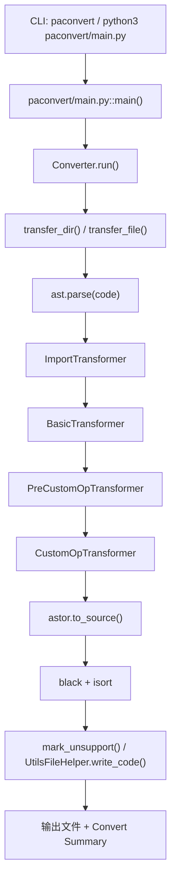

# PaConvert 是怎么运行的：源码阅读、API 转换链路与二次开发指南

这个仓库不是 PaConvert 源码，也不是官方 README 的改写版。它只把一条线讲清楚：命令怎么进来，AST 怎么一路走到输出，以及真要改一个 API 时先动哪几个文件。  
第一次接手 PaConvert，建议先看 [docs/02-how-paconvert-runs.md](./docs/02-how-paconvert-runs.md) 和 [docs/04-one-api-full-trace.md](./docs/04-one-api-full-trace.md)。  
如果你更想先看输入输出，再回头追源码，直接从 [examples/simple_add](./examples/simple_add) 和 [examples/optim_sgd](./examples/optim_sgd) 开始。

## 这个仓库在补什么

官方 README 足够你安装和跑工具，但你要追 `ImportTransformer` 和 matcher 的交接处，还是得回源码。这里补的是接手时最容易卡住的 5 个问题：

1. CLI 从哪里进主流程。
2. 一个 `torch API` 是怎么被识别、映射、改写并写回文件的。
3. `import`、参数归一化、matcher 分发、代码生成分别由谁负责。
4. 新增或修改一个 API 映射时，最小工程闭环是什么。
5. `tests`、`tools`、CI 分别在保护什么。

默认前提是：你会看 Python 和 AST，但还不熟这个仓库自己的组织方式。

## 建议阅读顺序

1. [docs/01-overview.md](./docs/01-overview.md)：先知道 upstream 里哪些目录值得先开。
2. [docs/02-how-paconvert-runs.md](./docs/02-how-paconvert-runs.md)：把 `main -> converter -> output` 走通。
3. [docs/03-import-transformer-matcher.md](./docs/03-import-transformer-matcher.md)：再拆 import、transformer、matcher 的边界。
4. [docs/04-one-api-full-trace.md](./docs/04-one-api-full-trace.md)：用两个真实 API 把流程落下来。
5. [docs/05-how-to-add-or-modify-an-api.md](./docs/05-how-to-add-or-modify-an-api.md)：回到工程动作，决定下一步改哪。

支撑材料放在后面：  
[docs/06-tests-tools-ci.md](./docs/06-tests-tools-ci.md) 讲回归保护，  
[docs/07-key-files-cheatsheet.md](./docs/07-key-files-cheatsheet.md) 适合边读源码边查，  
[docs/08-known-limits-and-pitfalls.md](./docs/08-known-limits-and-pitfalls.md) 收一些容易误判成 bug 的现象。

## 最核心的运行链路



流程细节放在 [docs/02-how-paconvert-runs.md](./docs/02-how-paconvert-runs.md)。首页只保留这一张图，够你定位入口就行。

## 两个 example 为什么选它们

`torch.add` 在 [examples/simple_add](./examples/simple_add)。它足够短，适合先看清一条最基本的包级 API 调用会经过哪些节点。  
`torch.optim.SGD` 在 [examples/optim_sgd](./examples/optim_sgd)。这个例子会经过 `GenericMatcher`，能看到参数归一化、参数改名和默认值补齐，比 `torch.add` 更接近你后面真的会改的 mapping。

具体 trace 放在 [docs/04-one-api-full-trace.md](./docs/04-one-api-full-trace.md)，README 不提前展开。

## 怎么复现最小示例

这份指南本身不带 PaConvert 源码。复现时要同时有 upstream 仓库和本仓库。

```bash
# 例 1：simple_add
cd <UPSTREAM_REPO_ROOT>
python3 paconvert/main.py \
  -i <GUIDE_REPO_ROOT>/examples/simple_add/input_torch.py \
  -o /tmp/simple_add_out.py \
  --log_dir disable

# 例 2：optim_sgd
cd <UPSTREAM_REPO_ROOT>
python3 paconvert/main.py \
  -i <GUIDE_REPO_ROOT>/examples/optim_sgd/input_torch.py \
  -o /tmp/optim_sgd_out.py \
  --log_dir disable
```

这两个示例里的 `expected_paddle.py` 都基于当前 upstream 的实际执行结果，不是手写推演。执行环境见 [notes/upstream-version.md](./notes/upstream-version.md)。

## 对应的 upstream 版本

版本信息集中放在 [notes/upstream-version.md](./notes/upstream-version.md)。当前这批文档基于：

1. 上游路径：`./PaConvert`
2. 分支：`master`
3. commit：`85c9d0b76ec1a14ab839aaf54e3aecdff5468eb1`
4. 阅读日期：`2026-04-22`

## 免责声明

这是源码阅读指南，不是官方文档。  
正文尽量只写当前源码里能落到文件路径、类名和调用关系上的内容；不能从源码直接确认的地方会明确标 `不确定`。
