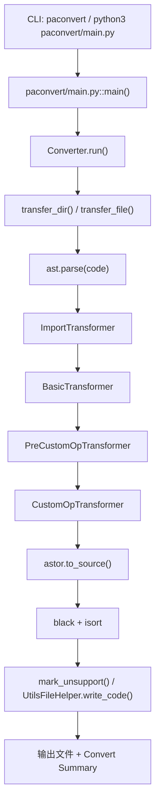

# PaConvert 是怎么运行的：源码阅读、API 转换链路与二次开发指南

仓库只保存 PaConvert 的读码交接说明，不放上游源码。重点是三件事：命令从哪里进来，AST 怎么走到输出，改一个 API 映射时先动哪几个文件。

入口文档看 [docs/02-how-paconvert-runs.md](./docs/02-how-paconvert-runs.md)，具体 API trace 看 [docs/04-one-api-full-trace.md](./docs/04-one-api-full-trace.md)。想先看输入输出，直接开 [examples/simple_add](./examples/simple_add) 和 [examples/optim_sgd](./examples/optim_sgd)。

官方 README 能覆盖安装和运行；追 `ImportTransformer`、`BasicTransformer`、matcher 的交接处，还是要回到 `paconvert/main.py`、`paconvert/converter.py`、`paconvert/transformer/`、`paconvert/api_matcher.py`。

这套文档默认读者会看 Python 和 AST，但还不熟 PaConvert 的文件分工。写法尽量落在路径、函数和例子上，避免把官方 README 重新讲一遍。

## 读法

先读 [docs/01-overview.md](./docs/01-overview.md) 里的文件打开顺序，再读 [docs/02-how-paconvert-runs.md](./docs/02-how-paconvert-runs.md) 的主链路。`docs/03` 拆 import / transformer / matcher，`docs/04` 用 `torch.add` 和 `torch.optim.SGD` 落到真实例子，`docs/05` 回到新增 API 的改动动作。

[docs/06-tests-tools-ci.md](./docs/06-tests-tools-ci.md)、[docs/07-key-files-cheatsheet.md](./docs/07-key-files-cheatsheet.md)、[docs/08-known-limits-and-pitfalls.md](./docs/08-known-limits-and-pitfalls.md) 是查阅材料。

## 主链路



细节在 [docs/02-how-paconvert-runs.md](./docs/02-how-paconvert-runs.md)。

## Examples

`examples/simple_add` 看 `torch.add`：包级 API，mapping 很短，适合看 `ChangePrefixMatcher` 和主链路。  
`examples/optim_sgd` 看 `torch.optim.SGD`：会走 `GenericMatcher`，能看到位置参数归一化、`kwargs_change` 和 `paddle_default_kwargs`。

两个 `expected_paddle.py` 都来自当前 upstream 的实际转换结果。`simple_add` 的 summary 会统计两个 `torch.tensor(...)` 和一个 `torch.add(...)`；`optim_sgd` 会显式补出 `weight_decay=0.0`。

```bash
cd <UPSTREAM_REPO_ROOT>
python3 paconvert/main.py \
  -i <GUIDE_REPO_ROOT>/examples/simple_add/input_torch.py \
  -o /tmp/simple_add_out.py \
  --log_dir disable

python3 paconvert/main.py \
  -i <GUIDE_REPO_ROOT>/examples/optim_sgd/input_torch.py \
  -o /tmp/optim_sgd_out.py \
  --log_dir disable
```

`expected_paddle.py` 来自当前 upstream 的实际转换结果。版本信息见 [notes/upstream-version.md](./notes/upstream-version.md)。
