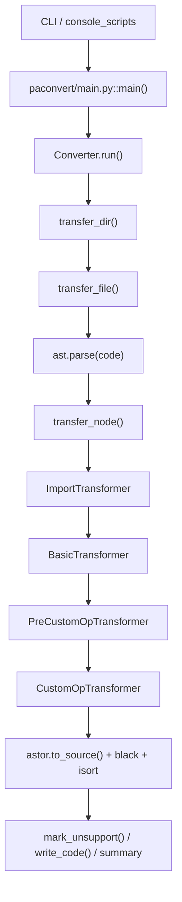

# 02. PaConvert 是怎么跑起来的

`paconvert/main.py::main()` 只解释 CLI 参数和任务颗粒度；真正开始组织转换的是 `paconvert/converter.py::Converter.run()`。



## `paconvert/main.py`

`setup.py` 注册 `paconvert=paconvert.main:main`。源码方式运行时，等价入口是：

```bash
python3 paconvert/main.py -i <input> -o <output>
```

`main()` 用 `argparse` 解析 `--in_dir`、`--out_dir`、`--exclude`、`--exclude_packages`、`--log_dir`、`--no_format`。`--exclude_packages` 会改 `GlobalManager.TORCH_PACKAGE_MAPPING`，直接影响后面 `ImportTransformer` 对 import 前缀的判断。

`--separate_convert` 会让 `main()` 按子项目分别创建 `Converter`；普通模式只创建一次，然后调用 `converter.run(args.in_dir, args.out_dir, args.exclude)`。

`log_dir` 也在这段参数里传下去。`Converter.__init__()` 根据它决定日志写终端、写文件，还是用 `disable` 关闭；import 删除、matcher 命中、格式化失败、helper 写入都会从这条日志线出来。

## `Converter.run()`

`Converter.run()` 先处理任务上下文：输入输出路径转绝对路径，默认输出目录补成 `paddle_project`，检查 `out_dir != in_dir`，把 `exclude` 拆成列表并追加 `__pycache__`。

`UtilsFileHelper` 也在 `run()` 里初始化。目录模式最后写 `<out_dir>/paddle_utils.py`，单文件模式把 helper 插回当前输出文件。matcher 后面可能登记 helper，所以这个对象必须先准备好。

`run()` 把入口交给 `transfer_dir()`。整棵树处理完后，`utils_file_helper.write_code()` 落盘，`Converter` 再打印 summary，必要时写 `all_api_map.xlsx` 和 `unsupport_api_map.xlsx`。

`only_complete` 会影响 unsupported 输出。默认转换会保留未支持调用并打 `>>>>>>`；读 `mark_unsupport()` 前要先确认这次运行是不是完整转换模式。

`exclude` 在 `run()` 里只是被拆成列表，真正跳过文件发生在 `transfer_dir()`。排查“为什么某个文件没被转”时，先看传入的正则，再看完整路径是否命中。

## `transfer_dir()`

`Converter.transfer_dir()` 管目录递归、`exclude` 和输出路径。文件直接交给 `transfer_file()`；目录则遍历子项继续递归，隐藏文件由 `listdir_nohidden()` 过滤。

`exclude` 用 `re.search(pattern, path)` 匹配完整路径。它不是 glob，也不只看 basename；目录名命中时，下面整段都会跳过。

目录输入会镜像创建输出树。单文件输入如果 `out_dir` 是目录，输出文件名沿用原 basename。

真正改写源码的入口只落到 `.py` 和 `requirements.txt`。目录里的 Markdown、模板文件、普通配置文件会被复制，不会按文本扫描 `torch`。

## `transfer_file()`

`Converter.transfer_file()` 决定单个文件怎么走。`.py` 文件读取源码后先 `ast.parse(code)`，再进 `transfer_node()`；非 Python 文件大多走 `shutil.copyfile(old_path, new_path)`。

`requirements.txt` 是特例，只做简单字符串替换：`torch -> paddlepaddle-gpu`。`pyproject.toml`、`setup.cfg`、YAML、shell 脚本不会进这条分支。

`.py` 分支里，`ast.parse(code)` 失败就不会进入 matcher。语法层面的坏文件不会靠 API 规则修回来。

## `transfer_node()`

`Converter.transfer_node()` 的默认 transformer 顺序写死为：

```text
ImportTransformer -> BasicTransformer -> PreCustomOpTransformer -> CustomOpTransformer
```

这个顺序只需要记一次：`ImportTransformer` 必须先跑，因为它会把 `import torch as th`、`from torch.nn import functional as F` 这类别名写进 `imports_map[file]`，并补回 `import paddle`。没有这一步，`BasicTransformer` 看到的只是 `th.add`、`F.relu`，后面的 matcher 拿不到稳定的 canonical API。

`BasicTransformer` 处理包级调用、类方法和属性访问，再查 `paconvert/api_mapping.json`、`paconvert/attribute_mapping.json`、`paconvert/api_matcher.py`。大多数 API mapping 都在这里被识别和分发。

`BasicTransformer` 插回的是 AST 节点，最终文本还要等 `astor.to_source()`。排查输出代码形态时，要同时看 matcher 产物和 `converter.py` 的回写阶段。

`PreCustomOpTransformer`、`CustomOpTransformer` 是 custom op 支线，主要覆盖 `torch.utils.cpp_extension`、`autograd.Function` 这类普通 mapping 表达不完的场景。`paconvert/transformer/tensor_requires_grad_transformer.py` 虽然存在，当前默认链路没有接它；源码能确认现状，原因不靠现有文件猜。

## 输出与 summary

`transfer_node()` 返回后，Python 文件先经 `astor.to_source()` 回写，再按配置过 `black.format_str()` 和 `isort.code()`。注释、空行、import 顺序变化，来源就在这条输出链。

`mark_unsupport()` 在源码字符串层面给未支持调用打 `>>>>>>`，发生在 AST 回写之后。matcher 不直接往 AST 节点里塞这个标记。

`UtilsFileHelper.write_code()` 在任务末尾统一写 helper。`Converter.run()` 的 summary 按识别到的 torch API 次数统计 `torch_api_count`、`success_api_count`、`faild_api_count`、`convert_rate`；`examples/simple_add/input_torch.py` 里有两个 `torch.tensor(...)` 和一个 `torch.add(...)`，统计就是 3 个 API。

输出阶段不要和 matcher 混在一起排查。matcher 负责生成替换节点和辅助语句，`converter.py` 负责把整棵 AST 变回源码、格式化、标记 unsupported、写文件。
