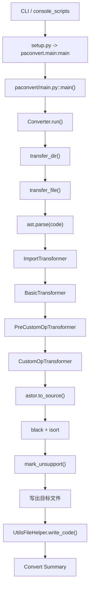

# 02. PaConvert 是怎么跑起来的

这一篇只回答一件事：`paconvert -i xxx` 之后，源码里到底按什么顺序往下走。

## 先看入口：不是从 transformer 开始

真正的 CLI 入口不是 `converter.py`，而是两步：

1. `setup.py` 里注册 `console_scripts: paconvert=paconvert.main:main`
2. `paconvert/main.py` 里的 `main()` 负责解析参数，再把工作交给 `Converter.run()`

如果你本地是直接跑源码，等价命令是：

```bash
python3 paconvert/main.py -i <input> -o <output>
```

这和“先打开 `api_matcher.py` 看规则”是两个完全不同的入口。前者回答“流程怎么走”，后者只回答“某个点怎么改”。

## CLI 参数解析后怎么进主调度

`paconvert/main.py` 的主流程可以压成下面几步：

1. 用 `argparse` 定义 `--in_dir`、`--out_dir`、`--exclude`、`--exclude_packages`、`--log_dir`、`--no_format` 等参数。
2. 如果传了 `--exclude_packages`，直接改 `GlobalManager.TORCH_PACKAGE_MAPPING`，这样后面 `ImportTransformer` 就不会再把这些包当前缀包识别。
3. 如果传了 `--separate_convert`，会对输入目录下每个子项目单独 new 一个 `Converter`，最后再汇总转换率。
4. 普通模式下只 new 一次 `Converter`，然后调用 `converter.run(args.in_dir, args.out_dir, args.exclude)`。

这里有个细节值得先记住：  
`main.py` 本身不做 AST，不扫目录，也不碰 matcher。它只负责“解释用户参数”和“决定 new 几个 Converter”。

## 这条调用链长什么样



这张图里最容易忽略的一点是：  
`ImportTransformer` 和 `BasicTransformer` 不是并列可替换关系，而是前后顺序强依赖。先不把别名补全，后面根本没法判断 `F.relu` 到底是谁。

## `Converter.run()` 先做什么

`paconvert/converter.py` 的 `Converter.run()` 先处理的是“任务级上下文”，不是代码内容本身。

它做的事情包括：

1. 把输入输出路径转成绝对路径。
2. 如果没给 `out_dir`，默认落到当前目录下的 `paddle_project`。
3. 确保 `out_dir != in_dir`。
4. 处理 `exclude`，额外总是把 `__pycache__` 加进排除列表。
5. 根据“输入是单文件还是目录”，初始化 `UtilsFileHelper`。
   - 目录模式下，helper 最后会写到 `<out_dir>/paddle_utils.py`
   - 单文件模式下，helper 会插回当前输出文件
6. 调 `transfer_dir()` 递归处理目录树。
7. 整棵树处理完之后，再统一 `utils_file_helper.write_code()`。
8. 最后打印 summary，必要时导出 `all_api_map.xlsx`、`unsupport_api_map.xlsx`。

## 文件扫描、exclude、输出目录、日志分别在哪里处理

### 文件扫描

目录递归在 `Converter.transfer_dir()`。

它的规则很直接：

1. 如果当前路径是文件，直接交给 `transfer_file()`。
2. 如果当前路径是目录，遍历目录项，递归进入子目录。
3. 隐藏文件和目录会被 `listdir_nohidden()` 跳过。

### exclude

`exclude` 是 CLI 层传进来的逗号分隔正则串，真正生效在 `Converter.run()` 和 `transfer_dir()`：

1. `run()` 先把字符串 split 成列表。
2. `transfer_dir()` 在“单文件入口”和“目录递归入口”两处都用 `re.search(pattern, path)` 判断是否跳过。

它不是基于 glob，也不是只按文件名匹配，是拿整个路径字符串做正则。

### 输出目录

输出路径逻辑在 `Converter.run()` 和 `transfer_dir()`：

1. 输入是单文件时，如果 `out_dir` 指向目录，输出文件名沿用原 basename。
2. 输入是目录时，输出目录树基本按原结构镜像创建。
3. 非 Python 文件不会改写，只会复制。

### 日志

日志句柄在 `Converter.__init__()` 里初始化：

1. `log_dir is None`：打到终端
2. `log_dir == "disable"`：直接关闭 logging
3. 其他字符串：写入对应文件

日志内容不是只有 summary。`ImportTransformer` 删除 import、`BasicTransformer` 命中或未命中 matcher、格式化失败、helper 写入，都会打日志。

## Python 文件和非 Python 文件怎么分流

真正的文件分流在 `Converter.transfer_file()`：

### `.py`

走完整 AST 链：

1. 读源码
2. `ast.parse(code)`
3. `transfer_node(root, old_path)`
4. `astor.to_source(root)`
5. 如果没开 `--no_format`，再走 `black` 和 `isort`
6. 如果不是 `only_complete` 模式，再走 `mark_unsupport()`
7. 写出目标文件

### `requirements.txt`

这是一个特例，不走 AST。当前实现只是简单做：

```text
torch -> paddlepaddle-gpu
```

也就是说，它不会去理解 `pyproject.toml`、`setup.cfg`、YAML 配置、shell 脚本里的依赖声明。只有文件名恰好以 `requirements.txt` 结尾，才会触发这个分支。

### 其他文件

直接 `shutil.copyfile(old_path, new_path)`。

这就是为什么模板文件、Markdown、配置文件里的 `torch` 文本不会被自动改。

## AST parse 之后主处理链是什么

`Converter.transfer_node()` 里把 transformer 顺序写死了：

1. `ImportTransformer`
2. `BasicTransformer`
3. `PreCustomOpTransformer`
4. `CustomOpTransformer`

这个顺序不是随便排的。

### 第 1 步：`ImportTransformer`

负责三件事：

1. 识别哪些 import 真是 torch 生态，哪些是本地模块或普通第三方包。
2. 把 `import torch as th`、`from torch.nn import functional as F` 这种别名记进 `imports_map[file]`。
3. 把源码里的局部别名补成完整 API 名，并在模块头部补回 `import paddle` 之类的导入。

### 第 2 步：`BasicTransformer`

这是主转换阶段。

它会处理：

1. 包级 API 调用，如 `torch.add(...)`
2. 类方法调用，如 `x.add(...)`、`optimizer.step()`
3. 属性访问，如 `x.device`、`tensor.T`

它自己不保存具体规则，规则在 `paconvert/api_mapping.json`、`paconvert/attribute_mapping.json` 和 `paconvert/api_matcher.py`。

### 第 3、4 步：自定义 C++ OP 相关

`PreCustomOpTransformer` 和 `CustomOpTransformer` 是专门处理 `torch.utils.cpp_extension`、`autograd.Function` 这类特殊场景的。

它们不是通用 API mapping 的主干，而是补上“普通 matcher 覆盖不了的自定义算子壳子”。

### 一个容易先入为主的误区

仓库里还有 `paconvert/transformer/tensor_requires_grad_transformer.py`。  
但当前 `transfer_node()` 默认链路没有把它加进去。

这件事源码层面可以确定，原因不能只靠现有代码确定。所以如果你读代码时已经预设“它一定会跑”，这里要先纠正。

## 处理完成后如何输出文件与总结统计

### 代码输出

Python 文件 AST 回写后，顺序是：

1. `astor.to_source()` 生成源码字符串
2. `black.format_str()` 尝试格式化
3. `isort.code()` 调整 import 顺序
4. `mark_unsupport()` 给未支持的行打 `>>>>>>`
5. 写到目标文件

所以“注释丢了、空行变了、import 顺序变了”不是后处理 bug，而是当前设计下的直接结果。

### helper 输出

如果某些 matcher 通过 `BaseMatcher.enable_utils_code()` 登记了辅助代码，`UtilsFileHelper.write_code()` 会在整个转换任务结束后统一落盘：

1. 目录模式下生成独立的 `paddle_utils.py`
2. 单文件模式下把 helper 插入输出文件 import 区之后

### summary

`Converter.run()` 最后打印的 summary 是按“识别到的 torch API 次数”统计的：

1. `torch_api_count`
2. `success_api_count`
3. `faild_api_count`
4. `convert_rate`

它不是按文件数算，也不是按“用户关心的那个 API 名”算。  
比如一个 `simple_add` 文件里同时有两个 `torch.tensor(...)` 和一个 `torch.add(...)`，summary 里看到的就是 3 个 API。

## 这一篇读完后，最好已经能回答的几个问题

1. CLI 入口在 `setup.py` / `paconvert/main.py`，不是在 matcher 里。
2. 目录递归和文件分流在 `Converter`，不是在 transformer。
3. import 恢复一定先于 matcher 分发。
4. `mark_unsupport()` 是源码层最后一步，不是 matcher 直接往文本里塞 `>>>>>>`。
5. 默认 transformer 链当前是 4 个，不是“凡是 `transformer/` 目录里有的都会跑”。
