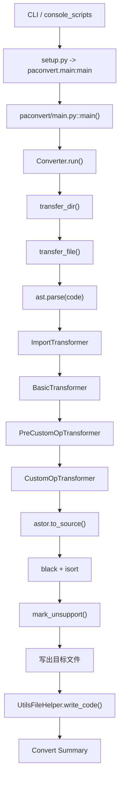

# 02. PaConvert 是怎么跑起来的

先把入口走通。命令进来后，`paconvert/main.py` 只做参数解释，真正开始搬代码的是 `Converter.run()`。

## `setup.py` 和 `paconvert/main.py`：入口只做分发

CLI 入口在 `setup.py`，注册的是 `paconvert=paconvert.main:main`。如果你本地直接跑源码，等价命令就是：

```bash
python3 paconvert/main.py -i <input> -o <output>
```

`paconvert/main.py` 里的 `main()` 用 `argparse` 解析 `--in_dir`、`--out_dir`、`--exclude`、`--exclude_packages`、`--log_dir`、`--no_format` 这些参数，然后决定这次任务要创建多少个 `Converter`。

这里先记一个边界：`main.py` 不做 AST，不扫目录，也不碰 matcher。它只解释用户参数，再把任务交给 `Converter`。

## `main()`：参数解析之后，决定任务怎么切

参数解析完之后，`main()` 主要做两件事。

第一件是处理全局开关。`--exclude_packages` 会直接改 `GlobalManager.TORCH_PACKAGE_MAPPING`，这会影响后面 `ImportTransformer` 认不认某个 import 是 torch 生态。  
第二件是决定 `Converter` 的颗粒度。开了 `--separate_convert`，`main()` 会按输入目录下的子项目分别 new `Converter`，最后再把转换率汇总；普通模式下只会 new 一次，然后调用 `converter.run(args.in_dir, args.out_dir, args.exclude)`。

所以 `main.py` 的职责很清楚：它决定“怎么发车”，不决定“每个文件怎么改”。

## 调用链先放在这里



正文下面就按这条线往下走，不再另外画第二套流程图。

## `paconvert/converter.py::run()`：先搭任务框架，再碰代码

`Converter.run()` 一进来先处理任务级上下文。它会把输入输出路径转成绝对路径，给默认输出目录补上 `paddle_project`，同时确保 `out_dir != in_dir`。`exclude` 也是在这里拆成列表的，`__pycache__` 会额外追加进去。

这一层还会初始化 `UtilsFileHelper`。如果这次转换的是目录，helper 最后会写成 `<out_dir>/paddle_utils.py`；如果输入是单文件，helper 代码会插回当前输出文件。这个动作必须先做，因为后面的 matcher 可能随时登记自己需要的辅助代码。

任务框架搭好后，`run()` 才把入口统一交给 `transfer_dir()`。整棵树处理结束，`utils_file_helper.write_code()` 才会真正落盘，然后 `Converter` 再输出 summary，必要时写 `all_api_map.xlsx` 和 `unsupport_api_map.xlsx`。

## `transfer_dir()`：目录扫描、exclude 和输出路径都在这里

目录递归发生在 `Converter.transfer_dir()`。如果当前路径本来就是文件，它会直接把工作交给 `transfer_file()`；如果是目录，就遍历目录项继续递归。隐藏文件和隐藏目录会被 `listdir_nohidden()` 过滤掉。

`exclude` 也是在这一层真正生效的。CLI 传进来的值是逗号分隔的正则串，`run()` 先拆开，`transfer_dir()` 再对完整路径做 `re.search(pattern, path)`。它不是 glob，也不是只看文件名，所以目录名命中一样会被整段跳过。

输出路径也在这里定型。目录模式下，输出树基本按原目录镜像创建；单文件模式下，如果 `out_dir` 指向目录，输出文件名会沿用原来的 basename。

## `transfer_file()`：单个文件在这里分流

真正决定“这是不是 AST 任务”的地方是 `Converter.transfer_file()`。`.py` 文件会读取源码、`ast.parse(code)`、交给 `transfer_node()`，然后再把 AST 回写成代码。

`requirements.txt` 是一个特例。当前实现不走 AST，只做简单的依赖字符串替换：`torch -> paddlepaddle-gpu`。所以 `pyproject.toml`、`setup.cfg`、shell 脚本或 YAML 配置里的依赖声明都不在这条分支里。

剩下的文件直接走 `shutil.copyfile(old_path, new_path)`。这也是为什么模板、Markdown、配置文件里的 `torch` 文本不会被自动改掉。

## `transfer_node()`：AST 主链路在这里排死

`Converter.transfer_node()` 里有一条写死的 transformer 顺序：

1. `ImportTransformer`
2. `BasicTransformer`
3. `PreCustomOpTransformer`
4. `CustomOpTransformer`

这个顺序不能倒。`ImportTransformer` 先处理 import，把 `import torch as th`、`from torch.nn import functional as F` 这种别名记进 `imports_map[file]`，同时删掉旧 import，后面再按需要补 `import paddle`。如果这一步不先跑，`BasicTransformer` 看到的就只是 `F.relu`、`th.add` 这种局部名字，没法稳定定位到 canonical API。

`BasicTransformer` 是通用 API 转换的主干。包级函数、类方法和属性访问都从这里进入，再分发到 `paconvert/api_mapping.json`、`paconvert/attribute_mapping.json` 和 `paconvert/api_matcher.py`。大部分日常新增或修改的 API 映射，最后都落在这一层。

`PreCustomOpTransformer` 和 `CustomOpTransformer` 处理的是另一条支线，主要覆盖 `torch.utils.cpp_extension`、`autograd.Function` 这类普通 mapping 表达不完的场景。它们在默认链路里确实会跑，但不是大多数 API mapping 的入口。

这里顺手记一个容易读错的点：仓库里虽然有 `paconvert/transformer/tensor_requires_grad_transformer.py`，当前默认链路并没有把它接进 `transfer_node()`。这件事源码能确认；至于为什么后来没接，只靠现有文件没法下结论。

## AST 回写后：格式化、unsupported 标记和 helper 输出

Python 文件经过 `transfer_node()` 之后，会先走 `astor.to_source()` 把 AST 重新变成源码字符串。只要没开 `--no_format`，后面还会依次过 `black.format_str()` 和 `isort.code()`。所以转换后空行、注释位置、import 排序发生变化，是这条输出链的直接结果。

如果这次不是 `only_complete` 模式，`mark_unsupport()` 会在源码字符串层面给未支持调用打上 `>>>>>>`。这个顺序也值得记住：标记发生在 AST 已经回写之后，而不是 matcher 直接往 AST 节点里塞这几个字符。

helper 代码不会在命中当下立即写文件。matcher 只是通过 `BaseMatcher.enable_utils_code()` 登记需求，真正落盘是在整个转换任务结束后由 `UtilsFileHelper.write_code()` 统一处理。目录模式下生成独立的 `paddle_utils.py`，单文件模式下则插回输出文件 import 区之后。

## summary：统计的是 API 次数，不是文件数

`Converter.run()` 最后打印的 summary 看的是 `torch_api_count`、`success_api_count`、`faild_api_count` 和 `convert_rate`。这几个数都是按识别到的 torch API 次数累计的，不按文件数算。

所以一个很小的示例文件也可能让 summary 看起来比预想的大。比如 `examples/simple_add/input_torch.py` 里除了 `torch.add(...)`，还有两个 `torch.tensor(...)`，最终 summary 统计到的就是 3 个 API，而不是 1 个。

把这一篇记成一条线就够了：`main.py` 负责解释命令，`Converter` 负责组织任务，`transfer_node()` 负责 AST 主链，最后再统一输出文件和 summary。后面看 matcher 时，别再把入口、目录扫描和 AST 改写混成一层。
